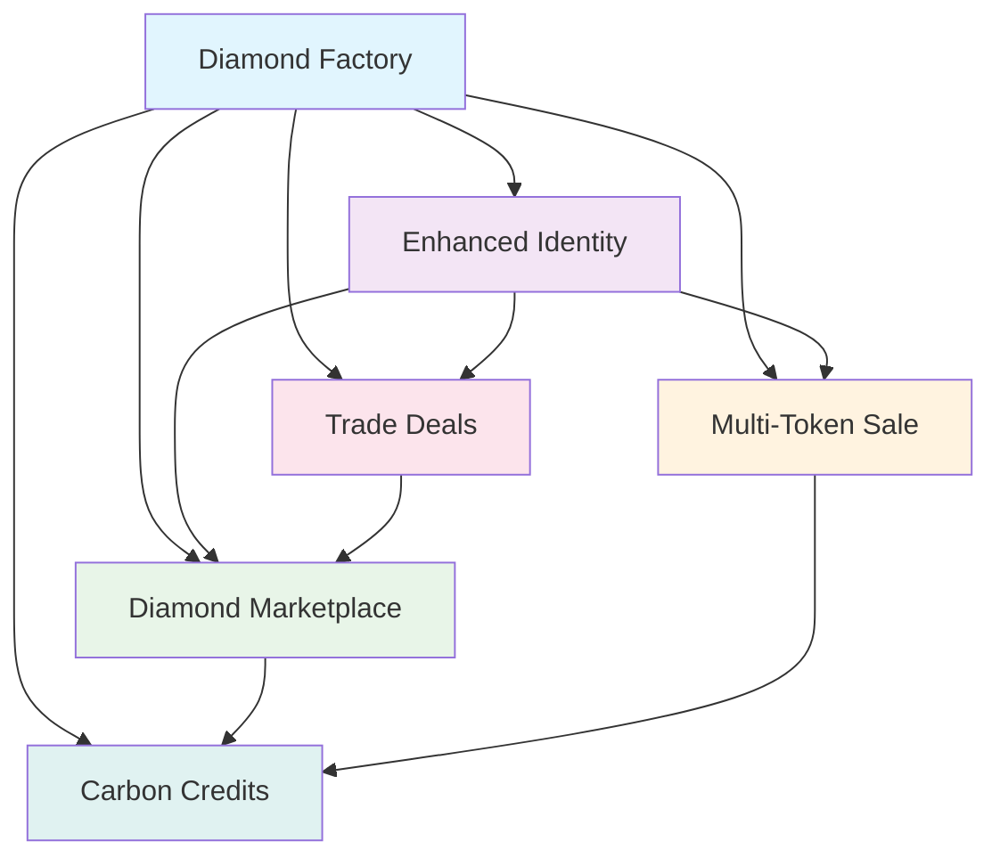

# Gemforce EIPs (Ethereum Improvement Proposals)

Welcome to the comprehensive collection of Ethereum Improvement Proposals developed by the Gemforce team. These EIPs represent innovative blockchain standards and patterns extracted from real-world smart contract implementations.

## Overview

The Gemforce EIP suite consists of six interconnected standards that work together to create a comprehensive blockchain ecosystem for digital identity, asset management, and environmental sustainability.

## EIP Collection

### 🏪 [Diamond-Enhanced NFT Marketplace](EIP-DRAFT-Diamond-Enhanced-Marketplace.md)
**Status**: Draft | **Category**: Standards Track - ERC

A standardized interface for NFT marketplaces built on the Diamond Standard (EIP-2535) with advanced features:

- **Configurable Fee Distribution**: Parts-per-million precision for multiple fee receivers
- **Multi-Payment Support**: Both ETH and ERC20 token payments
- **Identity Verification**: Integration with ERC734/ERC735 for buyer verification
- **Security Features**: Price protection and reentrancy protection
- **Modularity**: Diamond Standard enables upgradeable marketplace functionality

---

### 💰 [Multi-Token Sale Standard](EIP-DRAFT-Multi-Token-Sale-Standard.md)
**Status**: Draft | **Category**: Standards Track - ERC

A comprehensive standard for token sales supporting multiple token types and advanced purchase mechanisms:

- **Universal Token Support**: ERC20, ERC721, and ERC1155 tokens
- **Cryptographic Proofs**: Merkle proof-based allowlist purchases
- **Flexible Payments**: ETH and ERC20 payments with automatic refunds
- **Purchase Controls**: Per-account limits and quantity tracking
- **Batch Operations**: Efficient multi-token operations

---

### 🤝 [Collateralized Trade Deal Standard](EIP-DRAFT-Collateralized-Trade-Deal-Standard.md)
**Status**: Draft | **Category**: Standards Track - ERC

A standardized interface for creating and managing collateralized trade deals for invoice financing:

- **Invoice NFTs**: Tokenized invoices as collateral
- **Multi-Party Funding**: Proportional token distribution
- **Automated Interest**: Calculation and distribution systems
- **Identity Controls**: Claim-based participation requirements
- **Flexible Operations**: Multiple financing scenario modes

---

### 🆔 [Enhanced Identity System](EIP-DRAFT-Enhanced-Identity-System.md)
**Status**: Draft | **Category**: Standards Track - ERC

An enhanced identity standard extending ERC734/ERC735 with enterprise-grade features:

- **Trusted Issuer Registry**: Centralized claim topic authorization
- **Attribute Management**: Typed attributes with verification status
- **Smart Contract Integration**: Automated verification for dApps
- **Access Control**: Claim topic-based permissions
- **Compliance Features**: Verification status tracking

---

### 🏭 [Diamond Factory Standard](EIP-DRAFT-Diamond-Factory-Standard.md)
**Status**: Draft | **Category**: Standards Track - ERC

A standardized factory pattern for deploying and managing Diamond Standard contracts:

- **Template Deployment**: Predefined Diamond configurations
- **Configurable Facets**: Flexible facet set management
- **Security Features**: Upgrade timelock initialization
- **Event Tracking**: Deployment verification and monitoring
- **Tooling Integration**: Compatible with existing Diamond infrastructure

---

### 🌱 [Carbon Credit Standard](EIP-DRAFT-Carbon-Credit-Standard.md)
**Status**: Draft | **Category**: Standards Track - ERC

A comprehensive standard for tokenizing and trading environmental assets:

- **Asset Tokenization**: NFTs or fungible tokens for carbon credits
- **Lifecycle Tracking**: From issuance to retirement
- **Registry Integration**: Compatible with VCS, CDM, Gold Standard
- **Automated Retirement**: Smart contract-based offset mechanisms
- **Fractional Trading**: Divisible environmental assets

---

## Ecosystem Integration

These EIPs are designed as an interconnected ecosystem:

### Integration Patterns

- **Foundation Layer**: Diamond Factory enables deployment of all other standards
- **Identity Layer**: Enhanced Identity System provides access control across all systems
- **Asset Layer**: Multi-Token Sale enables distribution of tokens used in other systems
- **Trading Layer**: Marketplace facilitates trading of all tokenized assets
- **Finance Layer**: Trade Deals enable sophisticated financial products
- **Environmental Layer**: Carbon Credits enable sustainability features

## Implementation Status

All EIPs include:

- ✅ Complete interface specifications
- ✅ Detailed rationale and motivation  
- ✅ Implementation examples and patterns
- ✅ Security considerations
- ✅ Reference to actual smart contract implementations
- ✅ Test case requirements
- ✅ Backwards compatibility analysis

## Standards Compliance

These EIPs build upon and extend existing Ethereum standards:

| Standard | Purpose | Integration |
|----------|---------|-------------|
| **EIP-2535** | Diamond Standard | Foundation for all upgradeable contracts |
| **EIP-721** | Non-Fungible Tokens | NFT marketplace and carbon credits |
| **EIP-20** | Token Standard | Payment tokens and fungible assets |
| **EIP-1155** | Multi Token Standard | Hybrid token implementations |
| **ERC-734** | Key Manager | Identity system foundation |
| **ERC-735** | Claim Holder | Identity verification |
| **EIP-165** | Interface Detection | Standard interface support |

## Getting Started

### For Developers
1. Start with the [Diamond Factory Standard](EIP-DRAFT-Diamond-Factory-Standard.md) to understand deployment patterns
2. Implement [Enhanced Identity System](EIP-DRAFT-Enhanced-Identity-System.md) for access control
3. Choose specific standards based on your use case:
   - **NFT Trading**: [Diamond-Enhanced Marketplace](EIP-DRAFT-Diamond-Enhanced-Marketplace.md)
   - **Token Sales**: [Multi-Token Sale Standard](EIP-DRAFT-Multi-Token-Sale-Standard.md)
   - **Financial Products**: [Collateralized Trade Deal Standard](EIP-DRAFT-Collateralized-Trade-Deal-Standard.md)
   - **Environmental Assets**: [Carbon Credit Standard](EIP-DRAFT-Carbon-Credit-Standard.md)

### For Integrators
2. Examine the interface specifications in each EIP
3. Check security considerations and implementation notes
4. Review test case requirements for compliance

## Community & Contribution

These EIPs represent innovative patterns extracted from production smart contract implementations. We welcome community feedback and contributions to refine these standards before formal submission to the Ethereum community.

### Next Steps
- **Community Review**: Gathering feedback from the Ethereum community
- **Reference Implementations**: Completing and auditing reference implementations
- **Test Suites**: Developing comprehensive test suites
- **Documentation**: Creating developer guides and integration examples
- **Formal Submission**: Following the official EIP process

---

*Last updated: June 26, 2025*