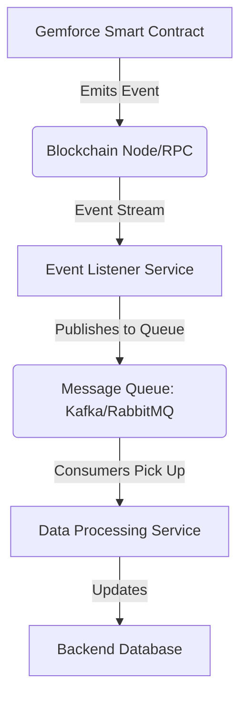

# Integrator's Guide: Integration Patterns

Designing robust and scalable integrations with the Gemforce platform requires adhering to established patterns. This guide explores common integration patterns, providing architectural recommendations and considerations for various scenarios, from simple dApp connections to complex enterprise systems.

## Overview of Integration Patterns

Effective integration patterns help you to:

-   **Improve Reliability**: Design systems that are resilient to failures and data inconsistencies.
-   **Enhance Scalability**: Build components that can handle increasing load efficiently.
-   **Simplify Maintenance**: Create modular and understandable integrations that are easier to update.
-   **Optimize Performance**: Minimize latency and resource consumption.

This guide covers patterns for:

1.  **Frontend/Backend Separation for Blockchain Interaction**
2.  **Event-Driven Architectures**
3.  **Data Synchronization Patterns**
4.  **Transaction Management Patterns**
5.  **Microservices with Blockchain Integration**

## 1. Frontend/Backend Separation for Blockchain Interaction

This pattern advocates for separating blockchain interaction logic.

### Pattern Description

-   **Frontend (Client-side)**: Primarily handles user interaction, wallet connection (e.g., MetaMask, WalletConnect), and direct `view` or `pure` smart contract calls. It might also initiate `send transaction` requests, but typically delegates complex transaction building or state changes to a backend.
-   **Backend (Server-side)**: Manages sensitive operations, private keys, heavy computations, data indexing, and interaction with external services (like DFNS, traditional databases). It can also broadcast signed transactions received from the frontend or generated internally.

### Advantages

-   **Security**: Private keys are never exposed to the client.
-   **Performance**: Offloads heavy computations from the client.
-   **Scalability**: Backend can be scaled independently.
-   **Control**: Centralized logic for complex transactions and data validation.

### Considerations

-   **Latency**: Introducing a backend might add slight latency for operations that could be done purely client-side.
-   **State Management**: Requires careful synchronization of on-chain and off-chain state.

### Example Architecture

```
+----------------+       +-------------------+       +--------------------+
|                |       | Node.js / Python  |       |                    |
|                |       |   Backend Service |       | Gemforce Smart     |
|  User Frontend | <---->|                   | <---->|   Contracts        |
| (React/Vue/JS) |       | - Private Key Mgmt|       |(Diamond, Facets...) |
|                |       | - Transaction API |       |                    |
| - Wallet Connect|<----> | - Data Indexing   |       |                    |
| - View Calls   |       | - DFNS Integration|       |                    |
+----------------+       +-------------------+       +---------^----------+
                                                          |
                                                          |  Real-time Events
                                                          |
                                                      +-----------------+
                                                      | Blockchain Node |
                                                      |  / RPC Provider |
                                                      +-----------------+
```

## 2. Event-Driven Architectures

This pattern focuses on reacting to events emitted by smart contracts or the Gemforce cloud platform.

### Pattern Description

-   Deploy dedicated services (listeners) that monitor blockchain events (via RPC providers like Infura, Alchemy, or specialized indexing solutions like The Graph, Moralis) or Gemforce webhooks.
-   When an event is detected, the listener triggers downstream processes (e.g., updates a database, sends notifications, initiates complex business logic).

### Advantages

-   **Real-time Updates**: Immediate reaction to on-chain or platform state changes.
-   **Decoupling**: Different services can operate independently, reducing inter-dependency.
-   **Scalability**: Listeners and processing services can be scaled to handle event volume.
-   **Auditability**: Events provide a clear audit trail of significant actions.

### Considerations

-   **Event Ordering**: Ensuring correct processing order for events can be complex.
-   **Duplicate Events**: Handle potential duplicate event receipts (idempotency).
-   **Indexing Lag**: Be aware of potential delays between event emission and detection by your listener.

### Example Flow



## 3. Data Synchronization Patterns

Ensuring consistency between on-chain data and your off-chain databases.

### Pattern Description

-   **Event-Sourcing**: The most robust approach. The canonical source of truth for certain data remains on-chain (events). Your off-chain database is a projection of these events.
-   **Snapshotting**: Periodically read the full state from smart contracts and update your database. Less real-time, but simpler for static or slowly changing data.
-   **Hybrid**: Combine event listening for real-time updates with periodic full synchronization for resilience or complex data.

### Advantages

-   **Consistency**: Maintains coherent data across distributed systems.
-   **Resilience**: Can rebuild off-chain state from on-chain data.

### Considerations

-   **Read/Write Performance**: Queries on raw blockchain data can be slow; off-chain indexing improves read performance.
-   **Complexity**: Requires careful design to handle reorgs (blockchain reorganizations) and ensure eventual consistency.

### Example

Listening to `TradeDealCreated` events and saving them to a MongoDB.

```javascript
// From Trade Deal Listener example (simplified)
tradeDealManagement.on("TradeDealCreated", async (tradeDealId, creator, amount, assetToken, event) => {
    // Save to MongoDB via Mongoose
    const newTradeDeal = new TradeDealModel({
        _id: tradeDealId, // Use tradeDealId as primary key
        creatorAddress: creator,
        amount: ethers.utils.formatEther(amount),
        assetTokenAddress: assetToken,
        createdAtBlock: event.blockNumber,
        transactionHash: event.transactionHash
    });
    await newTradeDeal.save();
    console.log(`Saved new trade deal ${tradeDealId} to MongoDB.`);
});
```

## 4. Transaction Management Patterns

Handling the lifecycle of blockchain transactions.

### Pattern Description

-   **Client-Side Signing, Backend Broadcasting**: Frontend gets user signature, passes signed transaction to backend, which broadcasts it. (Good for privacy/user control).
-   **Backend Signing (via DFNS/Private Key)**: Backend creates and signs transactions (using DFNS or its own secure private keys), then broadcasts. (For automated processes, admin tools).
-   **Transaction Relayers**: Users sign a meta-transaction, and a relayer pays gas to execute it on their behalf. (For gas abstraction, improving UX).

### Advantages

-   **Enhanced Security**: Protects private keys.
-   **Improved UX**: Can abstract gas fees or complex signing.
-   **Automated Operations**: Enables programmatic control over on-chain actions.

### Considerations

-   **Latency**: Relayers or backend signing can add latency.
-   **Trust**: Requires trusting the backend or relayer with transaction details.
-   **Gas Management**: Backend/relayer needs robust gas estimation and management.

## 5. Microservices with Blockchain Integration

Structuring your application as small, independently deployable services, with some integrating specifically with blockchain.

### Pattern Description

-   Each microservice (e.g., User Service, Marketplace Service, Identity Service) owns its data and business logic.
-   Blockchain interaction is encapsulated within dedicated "blockchain microservices" or "blockchain adapters" that handle communication with smart contracts and event listening.
-   These services communicate via APIs, message queues, or shared databases (if applicable).

### Advantages

-   **Modularity**: Services are isolated and easier to develop, test, and deploy.
-   **Scalability**: Individual services can be scaled based on demand.
-   **Technology Flexibility**: Different services can use different technologies.
-   **Resilience**: Failure in one service is less likely to affect the entire system.

### Considerations

-   **Distributed Transactions**: Managing consistency across multiple services and the blockchain can be challenging.
-   **Operational Overhead**: More services mean more operational complexity (deployment, monitoring).
-   **Data Consistency**: Careful design needed to ensure eventual consistency between services.

### Example Architecture

```
+------------+   +-------------------+   +---------------------+   +-----------------+
| User Micro |<->| Auth Microservice |<->| Blockchain Micro (SC) |<->| Smart Contracts |
|  Service   |   | (Parse Server)    |   |  - On-chain Writes  |   +-----------------+
+------------+   +-------------------+   |  - Tx Status Mgmt   |
     |                                   +---------------------+
     |                                           /\       /\
     V                                           |        |   Event Stream
+-----------+   +---------------------+   +-----/--+   +--\----+
| Other App |<->| Marketplace Micro   |<->| Events Listener |   | Blockchain Node |
| Microservices |   | Service             |   | (Indexer)       |   |   / RPC Provider  |
+-----------+   +---------------------+   +-----------------+   +-----------------+
```

## Related Documentation

-   [ integrators-guide/authentication.md ](../integrator-guide/authentication.md)
-   [ integrators-guide/smart-contracts.md ](../integrator-guide/smart-contracts.md)
-   [ integrators-guide/rest-api.md ](../integrator-guide/rest-api.md)
-   [ integrators-guide/webhooks.md ](../integrator-guide/webhooks.md)
-   [System Architecture: Gemforce System Architecture](../system-architecture/gemforce-system-architecture.md)